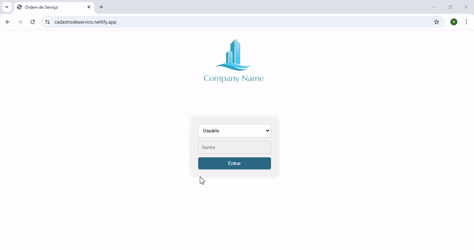

# CRUD de Serviço

Este projeto é um sistema CRUD (Create, Read, Update, Delete) para gerenciamento de serviços, desenvolvido com o objetivo de demonstrar boas práticas e facilitar a organização de tarefas relacionadas ao setor de manuteção de hotel.

## Demonstração do Projeto

 **Aqui está uma demonstração em vídeo do funcionamento do projeto:**

  

**Demonstração do layout para dispositivos móveis:**

  

###

***Você também pode acessar o sistema online [clicando aqui](https://cadastrodeservico.netlify.app/).***

###
---
## Funcionalidades
- Adicionar novos serviços.
- Visualizar a lista de serviços cadastrados.
- Atualizar informações de serviços existentes.
- Remover serviços do sistema.
- Imprimir um relatório dos serviços concluídos.

## Tecnologias Utilizadas
- **HTML**
- **CSS**
- **JavaScript**
- **Firebase** (como banco de dados)
  
## Contribuições
Sinta-se à vontade para contribuir com melhorias ou sugestões. Basta abrir um pull request ou entrar em contato.